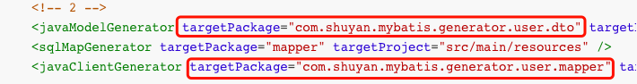
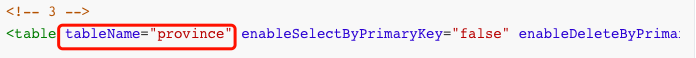
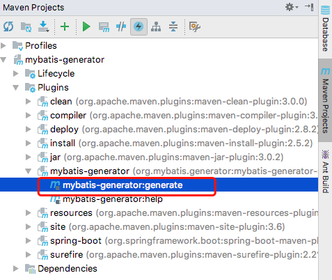

# mybatis-generator
> 自动根据数据库中字段生成实体类，mapper接口，xml文件

+ 在pom文件的插件配置中添加如下配置

  ```xml
  <plugin>
      <groupId>org.mybatis.generator</groupId>
      <artifactId>mybatis-generator-maven-plugin</artifactId>
      <version>1.3.6</version>
      <executions>
          <execution>
              <id>Generate MyBatis Artifacts</id>
              <phase>deploy</phase>
              <goals>
                  <goal>generate</goal>
              </goals>
          </execution>
      </executions>
      <dependencies>
          <dependency>
              <groupId>mysql</groupId>
              <artifactId>mysql-connector-java</artifactId>
              <version>5.1.47</version>
          </dependency>
          <dependency>
              <groupId>org.mybatis.generator</groupId>
              <artifactId>mybatis-generator-core</artifactId>
              <version>1.3.7</version>
          </dependency>
          <dependency>
              <groupId>com.github.oceanc</groupId>
              <artifactId>mybatis3-generator-plugin</artifactId>
              <version>0.4.0</version>
          </dependency>
      </dependencies>
  </plugin>
  ```

+ 在`resources`目录下创建`generatorConfig.xml`，文件内容如下

  ```xml
  <?xml version="1.0" encoding="UTF-8" ?>
  <!DOCTYPE generatorConfiguration PUBLIC "-//mybatis.org//DTD MyBatis Generator Configuration 1.0//EN" "http://mybatis.org/dtd/mybatis-generator-config_1_0.dtd" >
  <generatorConfiguration>
  
      <properties resource="application-dev.properties"/>
  
      <context id="MysqlContext" targetRuntime="MyBatis3Simple" defaultModelType="flat">
  
          <property name="javaFileEncoding" value="UTF-8"/>
          <property name="beginningDelimiter" value="`"/>
          <property name="endingDelimiter" value="`"/>
          <property name="enableSelectByPrimaryKey" value="false"/>
          <property name="javaFormatter" value="org.mybatis.generator.api.dom.DefaultJavaFormatter"/>
          <property name="xmlFormatter" value="org.mybatis.generator.api.dom.DefaultXmlFormatter"/>
          <plugin type="org.mybatis.generator.plugins.SerializablePlugin" />
          <!--<plugin type="org.mybatis.generator.plugins.CachePlugin">-->
              <!--<property name="cache_type" value="org.mybatis.caches.ehcache.LoggingEhcache" />-->
          <!--</plugin>-->
          <plugin type ="com.github.oceanc.mybatis3.generator.plugin.LombokAnnotationPlugin" />
  
          <commentGenerator>
              <property name="suppressAllComments" value="true" />
              <property name="suppressDate" value="true"/>
          </commentGenerator>
  
          <!-- 1 -->
          <jdbcConnection driverClass="${spring.datasource.driver-class-name}"
                          connectionURL="${spring.datasource.url}"
                          userId="${spring.datasource.username}"
                          password="${spring.datasource.password}" />
  
          <!-- 2 -->
          <javaModelGenerator targetPackage="com.shuyan.mybatis.generator.user.dto" targetProject="src/main/java"/>
          <sqlMapGenerator targetPackage="mapper" targetProject="src/main/resources" />
          <javaClientGenerator targetPackage="com.shuyan.mybatis.generator.user.mapper" targetProject="src/main/java" type="XMLMAPPER" />
  
          <!-- 3 -->
          <table tableName="province" enableSelectByPrimaryKey="false" enableDeleteByPrimaryKey="false" />
  
      </context>
  </generatorConfiguration>
  ```

  > 需修改内容：

  + jdbc配置

    > 这里读取的是`application.properties`文件中`spring.datasource.*`的配置

  + model及mapper生成包名

    > 分别修改`javaModelGenerator`及`javaClientGenerator`标签的`targetPackage`属性

     

  + 添加`table`标签，选择要导出的表

     

+ 生成

  > 在maven窗口中的plugin中找到`mybatis-generator`并执行

   
